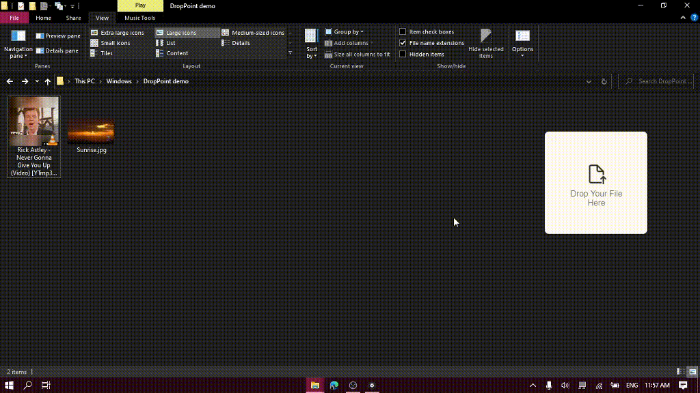

# DropPoint

Drag-and-Drop Assist

Make dragging and dropping across windows and virtual desktops/workspaces easier using DropPoint!

DropPoint holds your file(s)/folder temporarily so that you may navigate to a folder of your choice and drop it there.

Works on Windows, Linux and MacOS.

Follows Fluent design style to match Windows 11 aesthetics :)

## Demo

### Across maximized windows in the same desktop



### Across windows in different virtual desktops/workspaces


## Official Releases

- Windows
  - Download `DropPoint-1.x.x-win.zip` from Releases and extract to a blank folder. Run `DropPoint.exe`.
  - To enable stickyness across Virtual Desktops (Windows) go to Task view while DropPoint is running, right click it and tick **"Show Window from this app on all Desktops"**. Stickyness in other Operating Systems works by default.
- Mac
  - Download `DropPoint-1.x.x.dmg` from Releases and install. Open "System Preferences > Security & Privacy > Open Anyway"
  - Or Download `DropPoint-1.x.x-mac.zip` from Releases and extract to a blank folder. Run `DropPoint.app`. Open "System Preferences > Security & Privacy > Open Anyway"
- Linux
  - All Linux Distros: Download `DropPoint-1.x.x.AppImage` to run.
  - Debian-based Distros (Ubuntu, Mint, PopOs, etc): Download `droppoint_1.x.x_amd64.deb`.
  - Arch-based Distros (Manjaro, Arch, etc.): Download `droppoint-1.x.x.tar.gz`
  - RHEL-based Distros (Fedora, Red Hat, etc): Download `droppoint-1.x.x.x86_64.rpm`.

## Usage

- Drag and drop any file(s) or folder from the system into DropPoint, go to your desired location and drag it out.

- App minimises to tray by default when you close the instance. To open instance, click on system tray. To quit, right click on tray icon > Quit.
- While DropPoint is in the system tray, pressing **Shift + Caps Lock** anywhere in you PC would toggle an instance of DropPoint. (as tested on Windows)

## Developer Installation

**You must have NPM and Git installed in your PC**

1. Clone repo and change into directory
   ```bash
   git clone https://github.com/GameGodS3/DropPoint.git
   cd DropPoint
   ```
2. Install dependencies and run
   ```bash
    npm install
    npm start
   ```

**_Contributions are welcome!_**

## Credits

- [Ajay Krishna KV](https://github.com/AJAYK-01) for CI/CD and Releases
- Fluent icons from [Icons8](https://icons8.com)

## Related

- Project inspired from [Dropover app](http://dropoverapp.com) in MacOS
- For a more feature-rich, Linux friendly and GTK-based alternative, checkout [PyDrop](https://github.com/Roshan-R/PyDrop)
