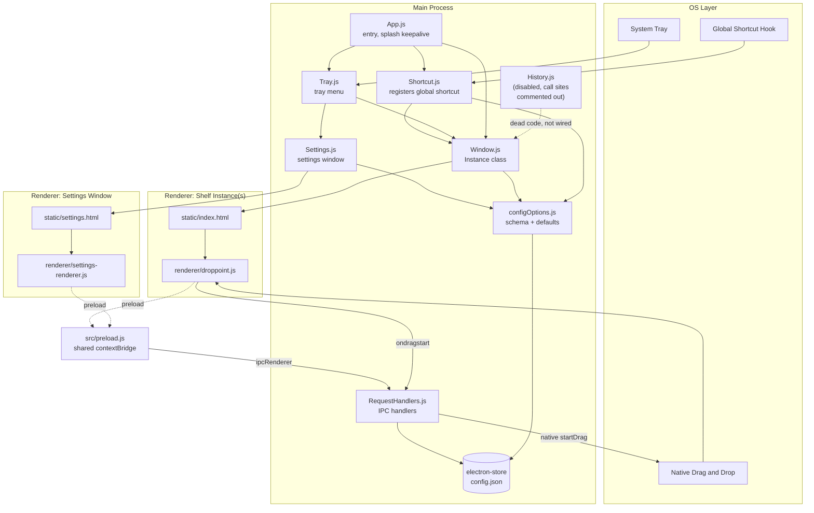
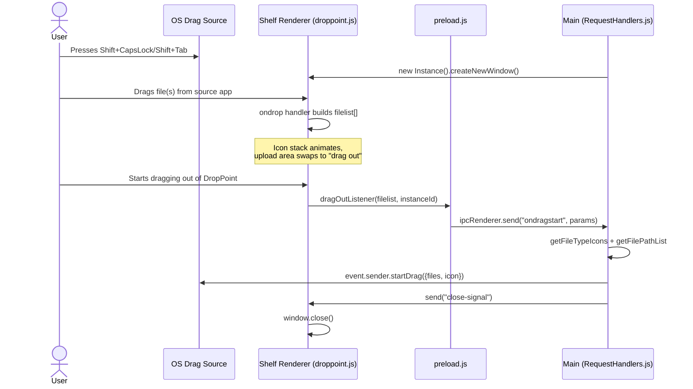
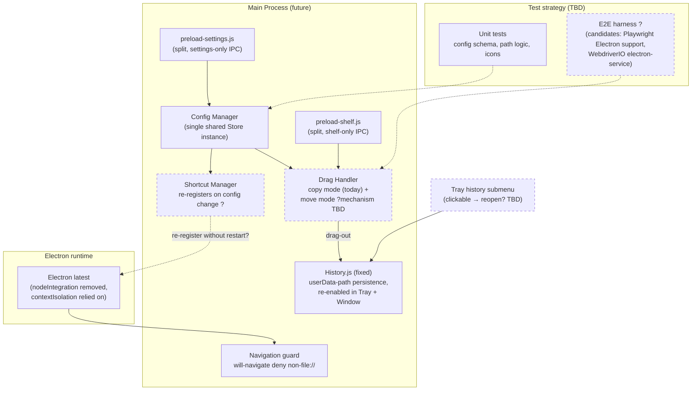

# DropPoint — Project Planning Doc

> Living document. Baseline snapshot taken 2026-07-22, covering `main` up to commit `8f1efa0`. Update this file as decisions get made and features land — don't fork a separate doc per feature.

## 0. Work log

### 2026-07-22 — Repo hygiene + Electron upgrade (branch `claude-contrib`)

Landed:

- **Electron `21.3.1` → `43.2.0`**, `electron-builder` `23.0.2` → `26.15.3`, `electron-updater` `4.3.9` → `6.8.9`. `electron-store` deliberately held at `^8.x` (v9+ is ESM-only; migrating would force a CommonJS→ESM rewrite of the whole main process — out of scope, tracked as a future decision).
- **Blocker fix — `File.path` removal (Electron 32+).** `renderer/droppoint.js` now resolves dropped-file paths via `window.electron.getPathForFile(f)`, backed by `webUtils.getPathForFile` newly exposed through the `src/preload.js` contextBridge. Without this, drag-in throws on every drop on Electron 43.
- **CI modernized.** `.github/workflows/build.yml`: `checkout@v1`/`setup-node@v1` → `@v4`, Node 18 → 22 (Electron 43 requires ≥22.12), and the archived `samuelmeuli/action-electron-builder` replaced with explicit `npm ci` + `npm run build` / `npm run release` steps (release still gated on `v*` tags). Added a `smoke_test` job (ubuntu + xvfb).
- **Smoke test added.** `test/smoke.spec.js` (Playwright `_electron`) boots the app and asserts the shelf window opens and the `getPathForFile` bridge is exposed — directly guarding the blocker fix. `npm test` runs it. Resolves the "zero automated tests" gap for the boot path.
- **Cleanup.** Removed the dead `<webview>` tag from `static/settings.html` (never functional — `webviewTag` was never enabled). Updated README's OS-support floor (Windows 10+, macOS 12 Monterey+) per Electron 43's raised minimums.

Deliberately **skipped** this pass (see §4 annotations):

- `nodeIntegration: true` → `false` + `contextIsolation`/`sandbox` hardening. Still functional on v43; the user flagged `nodeIntegration: true` as a likely deliberate workaround for a past bug, so it's left untouched pending its own investigation.

Known limitations of this pass:

- **Not verified in this environment.** The Electron binary can't be downloaded in the planning sandbox (GitHub release download is 403-blocked; only the npm registry is reachable), so the app was never booted here. The smoke test parses and is discovered locally (`playwright test --list`) but its first *real* execution is in CI / on a dev machine. Transparent/frameless/shadowed window rendering and Tray-under-xvfb behavior are the specific things to watch on that first run.

Follow-up not yet done: **prune stale branches** `imgbot` and `v1.2.0-patch` — `git push --delete` is 403-blocked by the managed git endpoint, so these need deleting via the GitHub UI. (`claude/project-overview-planning-w5yym2` was already gone; `test-suite` and `release` intentionally kept.) PR #36 (ImgBot) was closed.

## 1. What DropPoint is

DropPoint is a cross-platform (Windows/macOS/Linux) Electron desktop utility that acts as a drag-and-drop "shelf". You summon a small floating window with a global shortcut (`Shift+CapsLock` on Windows/Linux, `Shift+Tab` on macOS), drag files into it from one location, then drag them back out at a different location — including across virtual desktops/workspaces and while other apps are fullscreen. It avoids having to tile two windows side-by-side just to move files between them.

- Lives in the system tray / menu bar; multiple shelf "instances" can be open at once.
- Inspired by macOS apps like [Dropover](http://dropoverapp.com) and Yoink.
- License: GPL-3.0-or-later. Solo-maintained (GameGodS3 / sudevssuresh@gmail.com), with one external CI/release contributor (AJAYK-01).

## 2. Timeline

54 commits on `main`, **Oct 2021 → Jul 2023**, then dormant for ~2 years until this planning pass.

- **Oct–Dec 2021 — foundation**: Electron shell, tray icon, global shortcut, native `startDrag` in/out, per-file-type icons, splash-screen-as-background-keepalive trick.
- **Early 2022 — multi-instance model**: `Instance` class per shelf window, instance history tracking (later disabled), cursor-position spawning.
- **Mid–late 2022 — settings**: `electron-store`-backed config + schema, Settings GUI (Tailwind + Preline), IPC-based config read/write, macOS `Cmd+Q` fix, "launch minimized".
- **2023 — polish**: toast + cancel button in Settings UI (latest commit), Node 18 / electron-builder bump, dmg-license for macOS signing.
- **Last commit**: `8f1efa0` "Applied toast and cancel button close" (2023-07-31).
- **Version state**: `package.json` says **1.3.1**, not yet tagged/released. Latest actual GitHub release is `v1.2.1`; there's an untagged draft `v1.3.1-draft-1`.
- **Stale branches found during this pass** (not merged, kept for reference only):
  - `test-suite` — predates the Settings feature; an abandoned attempt at automated drag-and-drop testing via `iohook`/`robotjs`, with one test file (`test/basicTest.js`).
  - `v1.2.0-patch` — old superseded patch branch.

## 3. Current architecture

### File responsibility map

| File | Responsibility |
|---|---|
| `src/App.js` | App entry point. Splash-screen keepalive, wires up tray + shortcut, optional spawn-on-launch. |
| `src/Window.js` | `Instance` class — creates the frameless, transparent, always-on-top, all-workspaces shelf window; positions at cursor or screen center. |
| `src/Tray.js` | System tray menu (New Instance / Settings / Quit). Tray history submenu code exists but is commented out. |
| `src/Shortcut.js` | Registers the global shortcut; supports "toggle" vs. "spawn" behavior from settings. |
| `src/Settings.js` | Settings window; loads `static/settings.html`. |
| `renderer/settings-renderer.js` + `static/settings.html` | Dynamically renders boolean/enum controls from `configOptions.js` schema, applies via IPC. |
| `src/RequestHandlers.js` | IPC handlers: drag-start (native OS drag-out), minimise, config fetch/apply, debug print. |
| `src/preload.js` | Shared `contextBridge` preload for both the shelf and settings windows. |
| `src/History.js` | Per-instance file history persisted to `instanceHistory.json`. **Currently disabled** — call sites commented out in `App.js`/`Window.js`/`Tray.js`. |
| `src/configOptions.js` | Settings schema: `spawnOnLaunch`, `alwaysOnTop`, `openAtCursorPosition`, `shortcutAction` (toggle/spawn), `debug`. |
| `renderer/droppoint.js` + `static/index.html` | The shelf UI: drag-over animations, file-type icon stack, drag-out trigger, close button. |
| Build/release | `electron-builder` + GitHub Actions matrix (Linux/Mac/Win) → AppImage/deb/rpm/tar.gz, dmg (intel+arm64), nsis/zip. |

### Diagram — component view

### Diagram — drag-in → drag-out flow (sequence)

## 4. Architecture critique

- **Repeated `Store` instantiation.** `App.js`, `Window.js`, `Shortcut.js`, `RequestHandlers.js`, and `Settings.js` each do their own `new Store(configOptions)` instead of sharing one instance/module. Works because `electron-store` is file-backed, but invites schema drift and redundant I/O.
- **Shared preload script conflates two windows' concerns.** Both the shelf window and the settings window load the same `src/preload.js`, which exposes settings-only IPC (`fetchConfig`, `onConfigReceived`, `applySettingsInConfig`) to the shelf renderer and vice versa — unnecessary surface area per window.
- **Mixed-era security posture.** `nodeIntegration: true` is set on `BrowserWindow`s *and* a `contextBridge`-based preload is used. The contextBridge pattern assumes reliance on `contextIsolation` (on by default since Electron 12) instead of `nodeIntegration`. Leaving `nodeIntegration: true` on widens attack surface for no benefit — this is exactly what issue #51 flags. _(2026-07-22: deliberately left as-is — `nodeIntegration: true` is a suspected intentional workaround for a past bug; revisit with its own investigation rather than flipping it blind.)_
- **`History.js` persistence bug.** Writes to a bare relative path `"instanceHistory.json"` (resolved against CWD, not a stable app data directory) — lands in whatever directory the app happened to be launched from, not a predictable location. Must be fixed as part of finishing the feature.
- **Dead code left via commenting, not removal.** Tray history submenu, `History` init calls, splash-screen timers are all commented-out rather than deleted, scattered across `App.js`/`Window.js`/`Tray.js` — raises cognitive load reading the main process.
- **No single-instance coordination.** Every shortcut press / tray click spawns a brand-new `BrowserWindow`/`Instance`, with no `app.requestSingleInstanceLock()` or shared registry beyond the in-memory `Instance` class. Intentional today (multi-shelf is a feature), but will need a rethink once CLI control exists — a CLI invocation needs to *talk to* a running instance, not just spawn another one.
- **Settings renderer ships a dead fixture.** `renderer/settings-renderer.js` still contains a large hardcoded `configResponse`/`configObj` stub object left over from before the dynamic config-driven UI was wired up — unused but shipped.
- **Zero automated tests, no type checking.** Plain CommonJS JS, JSDoc only on a handful of functions. Any refactor (especially the Electron major-version upgrade) is currently unverifiable except by manual testing across three OSes. _(2026-07-22: first automated test added — `test/smoke.spec.js` boots the app and checks the preload bridge. Still no type checking and no coverage beyond the boot path.)_
- **Electron is ~4 majors behind** (v21, Nov 2022, vs. current ~v37). ~~Upgrading is entangled with the `nodeIntegration`/`contextIsolation` cleanup above, so they should land together rather than as separate efforts.~~ _(2026-07-22: **done** — upgraded to Electron 43.2.0. The `nodeIntegration` cleanup was intentionally decoupled and deferred rather than bundled in.)_

## 5. Backlog snapshot (26 open issues, 2 stale open PRs)

Grouped by theme, cross-referenced to the priorities picked for the next phase (§6):

| Theme | Issues | Status |
|---|---|---|
| **Move mode (not just copy)** | #9, #45 | Prioritized next |
| **Configurable shortcuts** | #52, #42, #10 (meta) | Prioritized next |
| **Electron/security modernization** | #51 | Electron upgrade **done** (2026-07-22); `nodeIntegration`/navigation-guard hardening from #51 still open |
| **Instance file history** | (feature exists, disabled) | Prioritized next — finish it |
| CLI / external automation | #55 | Backlog, not prioritized now |
| Multi-monitor support | #8 | Backlog |
| Packaging/signing friction (macOS Gatekeeper) | #47 | Backlog |
| Misc UX (cursor pointers, scrolling, website content) | #48, #49, #50, #56 | Backlog |
| Auto-sense drag / gesture launch | #46, #4 | Backlog |
| Homebrew / ARM Windows packaging | #37, #54 | Backlog |
| Launch-minimized / no-instance-on-startup | #38, #43 | Already partially addressed (`spawnOnLaunch` setting exists) |
| Stale open PRs | #35 (macOS shortcut → Option+Tab), ~~#36 (ImgBot)~~ | #36 **closed** (2026-07-22). #35 left open — may be superseded by configurable-shortcuts work |

## 6. Future architecture (tentative)

Roadmap priority for the next phase, per decision: **move mode, configurable shortcuts, Electron/security modernization, and finishing instance file history.** CLI/automation (#55) stays backlog. Testing gets a *fresh* strategy rather than reviving the old `iohook`/`robotjs` branch.

This diagram layers proposed changes onto the current architecture. Dashed nodes are **not yet decided** — see Open Questions below.

## 7. Open questions

Unresolved by design — answer these before implementation starts on the corresponding piece, and update this doc with the decision:

- **Move mode**: implement via post-drop source deletion (needs reliable drop-confirmation, since native OS drag doesn't report the actual drop effect back to Electron), or via a modifier-key toggle at drag-out time?
- **Configurable shortcuts**: `Shortcut.js` currently registers once at startup; changing it from Settings requires an app restart. Do we want live re-registration on save, and what does the rebind UI look like (raw key-combo capture vs. preset dropdown)?
- **History**: once fixed, should tray history entries be clickable to reopen those files into a new instance, or stay display-only as today?
- **Electron upgrade sequencing**: bump straight to latest, or stage it? Given zero tests today, should the test strategy land *before* or *alongside* the upgrade?
- **Test strategy**: unit-only for pure logic vs. adding an E2E harness for actual drag-and-drop (candidates: Playwright's Electron support, WebdriverIO's electron-service) — no decision yet.
- **Stale PRs**: what to do with #35 (macOS shortcut change) and #36 (ImgBot) — merge, close, or let the configurable-shortcuts work supersede #35 entirely?
